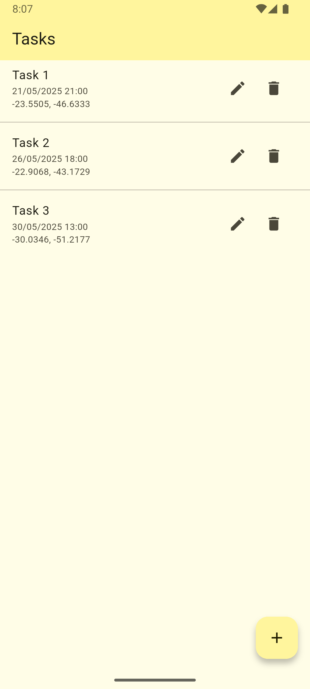
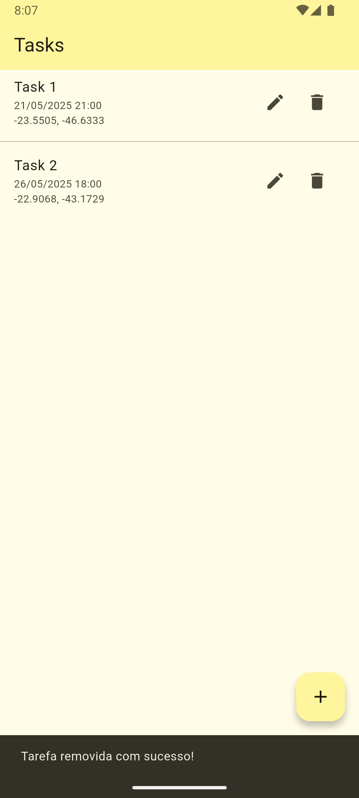
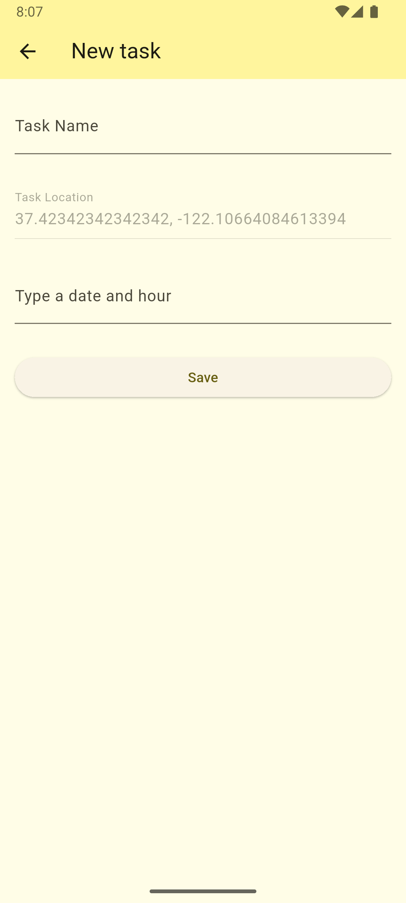
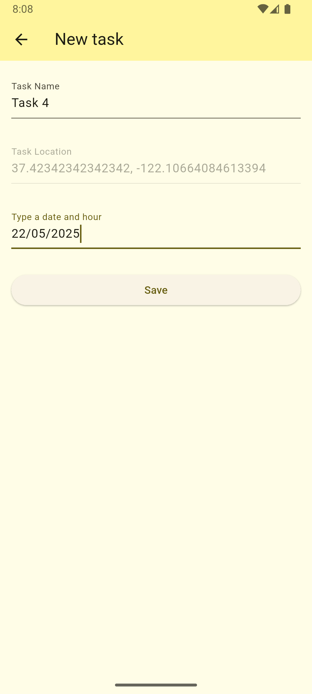
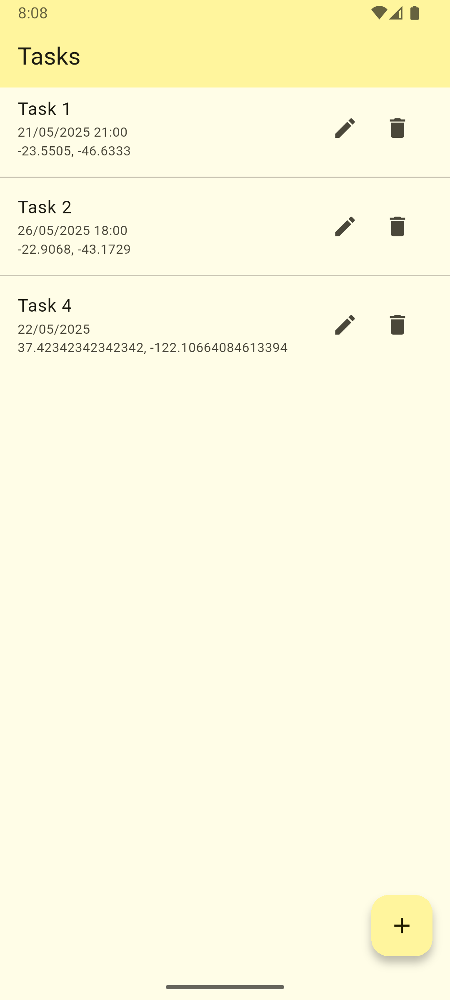
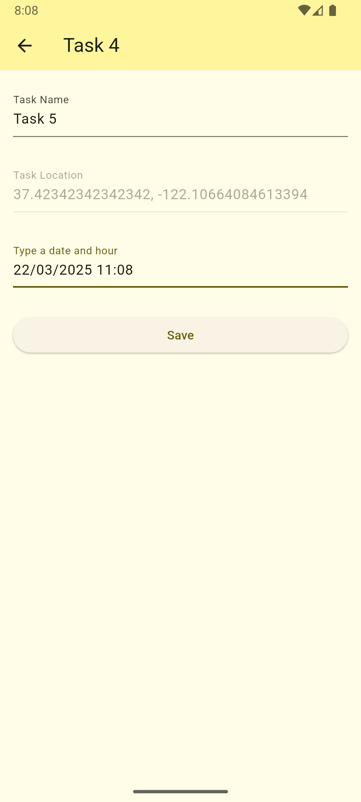
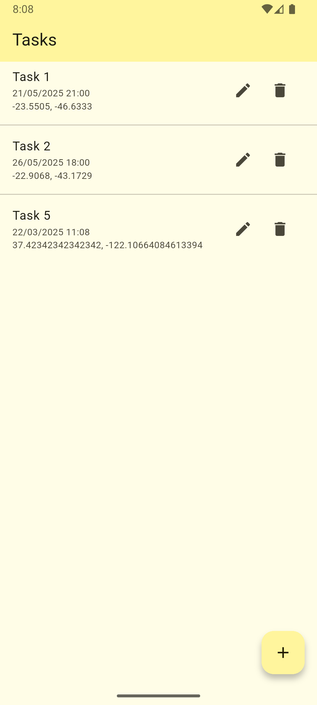

# todoapp

My first flutter app. 

This is a ToDo list that you can add, edit and delete some tasks.

## Snapshots

### Home Page

 

### Task Delete

### New Task

   

### New Task Filled

### New List

 

### Task Editing

 

### New List After Editing

